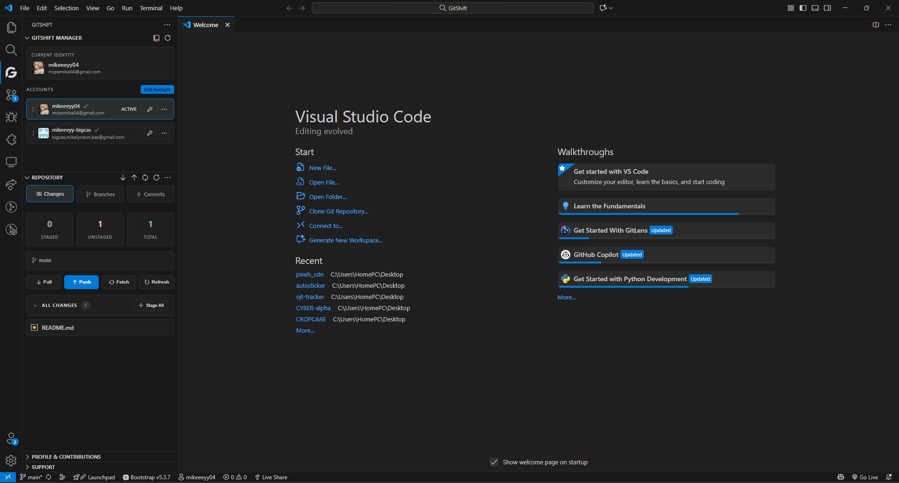

# GitShift Redux

<a href="https://code.visualstudio.com/" target="_blank" rel="noopener noreferrer"></a>
<a href="https://cursor.com/" target="_blank" rel="noopener noreferrer"></a>
<a href="LICENSE" target="_blank" rel="noopener noreferrer"></a>

> **Fork notice.** GitShift Redux is a fork of <a href="https://github.com/mikeeeyy04/GitShift" target="_blank" rel="noopener noreferrer"><strong>GitShift</strong></a> by <a href="https://github.com/mikeeeyy04" target="_blank" rel="noopener noreferrer"><strong>mikeeeyy04</strong></a>, specialized for <a href="https://cursor.com/" target="_blank" rel="noopener noreferrer"><strong>Cursor AI</strong></a>. All of the original functionality and credit belong to the upstream project; this fork builds on it with fixes that make the new-repository and publish flow work reliably inside Cursor (and other VS Code forks). See [What's different in this fork](#whats-different-in-this-fork) below.


A powerful extension that helps developers seamlessly switch between multiple GitHub accounts for commits and pushes. Never commit with the wrong identity again! GitShift Redux runs in **Cursor AI** as well as VS Code and other VS Code–based editors.

## What's different in this fork

Redux exists to make GitShift work reliably in **Cursor AI**, where running as a VS Code *fork* on Windows exposes problems the upstream extension hasn't addressed. Each item below is an issue reported upstream that's still open — and fixed here.

### 🔑 Cursor credential conflicts — [#6](https://github.com/mikeeeyy04/GitShift/issues/6) *(the headline fix)*

This is the reason Redux exists. In Cursor on Windows, switching between multiple authenticated GitHub accounts breaks pushes: Cursor's built-in GitHub auth and the Windows Credential Manager store a **single credential per host**, so each account silently overwrites the last and you end up pushing as the wrong identity (or failing auth entirely). Redux sets `credential.useHttpPath=true` so Git resolves a credential **per repository path** instead of one-per-host — letting multiple github.com accounts coexist instead of clobbering each other.

### git not on the extension-host PATH — [#9](https://github.com/mikeeeyy04/GitShift/issues/9)

In Cursor and other VS Code forks the extension host often starts **without Git on its `PATH`**, even though git works fine in the integrated terminal. Every git call then fails silently — account switching does nothing, no account ever shows as Active, and the panel insists you're "not in a Git repository." Redux repairs the extension-host PATH at startup (honoring your `git.path` setting first, then the standard Git-for-Windows locations) so git is always reachable.

### Initialize-repository deadlock — [#8](https://github.com/mikeeeyy04/GitShift/issues/8)

On a brand-new empty folder you couldn't get started: the extension wouldn't initialize a repo without a configured identity, but wouldn't let you set an identity until a repo existed. Redux breaks the loop — **Initialize** runs directly, and selecting an account falls back to your **global** identity until the repo exists (then writes repo-local config as before).

### Plus a couple of quality-of-life fixes

- **New repos default to `main`** — `git init -b main` (with safe fallbacks for older Git) instead of leaving you on `master`.
- **Publish an already-initialized repo** — a **Publish to GitHub** banner now appears for any repo that has no remote, so initializing locally no longer strands you with no way to push.

> **Tip:** *Publish to GitHub* is the all-in-one path (init + create-on-GitHub + commit + push) for a new project — use it instead of *Initialize Repository*, which is local-only.

Everything else behaves like upstream GitShift.

## Features

- **GitHub Authentication**: Sign in with real GitHub accounts using VS Code's built-in authentication for full push/pull access
- **Beautiful Sidebar Panel**: Dedicated Activity Bar view with minimalist dark theme and intuitive UI
- **Rich Account Manager**: Full-featured webview manager with add/edit/delete capabilities
- **One-Click Account Switching**: Switch between multiple GitHub accounts instantly
- **Status Bar Integration**: Always see your current Git identity at a glance
- **Smart Auto-Detection**: Automatically detects and displays your current Git configuration
- **Automatic Credential Management**: Configures git credentials automatically when using authenticated accounts
- **Workspace-Specific Configuration**: Git configuration is set per workspace, keeping your projects organized
- **Repository Management**: Built-in repository viewer with changes, branches, and commits
- **Contributions Graph**: Visualize your GitHub contributions calendar
- **GitHub Notifications**: View and manage your GitHub notifications
- **Quick Clone**: Clone repositories and automatically switch to the appropriate account
- **Secure Token Storage**: Uses VS Code's secure secret storage for all tokens



## Installation

GitShift Redux is distributed as a sideloaded `.vsix` (it is not on the VS Code Marketplace). The original upstream extension remains on the Marketplace if you want that instead.

### Build the `.vsix` from source

```bash
git clone https://github.com/incompletebiped/gitshift-redux.git
cd gitshift-redux
npm install
npm run compile
npm run package    # produces gitshift-redux-<version>.vsix
```

### Install in Cursor AI (or VS Code)

1. Open Cursor (or VS Code)
2. Press `Ctrl+Shift+X` (or `Cmd+Shift+X` on Mac) to open Extensions
3. Click the `...` menu (top right) → **"Install from VSIX..."**
4. Select the `gitshift-redux-<version>.vsix` you built above

> **Heads up:** GitShift Redux uses the extension ID `incompletebiped.gitshift-redux`, which is distinct from the upstream `mikeeeyy04.gitshift`. If you already have the original GitShift installed, **disable it** to avoid two GitShift sidebars side by side.

## Quick Start

### Method 1: Sign In with GitHub (Recommended)

1. Open a Git repository in VS Code
2. Click the **GitShift** icon in the Activity Bar (left sidebar)
3. Click **"Sign In with GitHub"**
4. Authorize VS Code when prompted
5. Your account is added automatically with full authentication!
6. Switch to it and start pushing immediately 🚀

### Method 2: Manual Setup with Personal Access Token

1. Create a GitHub Personal Access Token with `repo`, `user:email`, `read:user`, and `workflow` scopes
2. Open a Git repository in VS Code
3. Click the GitShift icon in the Activity Bar
4. Click **"Add/Replace GitHub Token"**
5. Paste your token
6. Your account is automatically added and ready to use!

### Method 3: Manual Configuration File

1. Open a Git repository in VS Code
2. Create a `.vscode/github-accounts.json` file in your workspace root
3. Add your GitHub accounts:

```json
[
  {
    "label": "Work Account",
    "name": "John Doe (Work)",
    "email": "john.doe@company.com"
  },
  {
    "label": "Personal Account",
    "name": "John Doe",
    "email": "john.personal@gmail.com"
  }
]
```

## Usage

### Switching Accounts

**Method 1: Sidebar Panel (Recommended)**

- Click the GitShift icon in the Activity Bar
- Click on any account in the list to switch instantly
- Current account is highlighted with a checkmark

**Method 2: Command Palette**

1. Press `Ctrl+Shift+P` (or `Cmd+Shift+P` on Mac)
2. Type **"GitHub: Switch Account"**
3. Select your desired account from the list

**Method 3: Status Bar**

- Click on the account name in the status bar (bottom left)
- Select your desired account from the list

### Viewing Current Account

- **Sidebar**: Open the GitShift sidebar to see the current account highlighted
- **Status Bar**: Your current account is always displayed in the status bar
- **Command**: Run "GitHub: Show Active Account" from the Command Palette

### Managing Accounts

- **Add Account**: Click "Sign In with GitHub" or "Add/Replace GitHub Token"
- **Delete Account**: Click the trash icon next to an account in the sidebar
- **Edit Account**: Edit the `.vscode/github-accounts.json` file directly

## Configuration

### Account Structure

Each account in `.vscode/github-accounts.json` must have:

- `label` (required): Display name shown in the picker (e.g., "Work Account")
- `name` (required): Full name for git commits (e.g., "John Doe (Work)")
- `email` (required): Email address for git commits (e.g., "john.doe@company.com")
- `username` (optional): GitHub username (added automatically when signing in)
- `authenticated` (optional): Whether the account has authentication enabled

### Example Configuration

```json
[
  {
    "label": "Work Account",
    "name": "Alice Smith",
    "email": "alice@company.com",
    "username": "alice-company",
    "authenticated": true
  },
  {
    "label": "Personal Account",
    "name": "Alice Smith",
    "email": "alice@personal.com",
    "username": "alice-personal",
    "authenticated": true
  },
  {
    "label": "Open Source",
    "name": "Alice Smith (OSS)",
    "email": "alice@opensource.dev"
  }
]
```

### Workspace vs Global

- **Workspace Configuration**: Accounts in `.vscode/github-accounts.json` are workspace-specific
- **Global Tokens**: GitHub tokens are stored securely and accessible across all workspaces
- **Auto-Import**: The extension automatically imports tokens from other workspaces

## Commands

This extension provides the following commands (accessible via `Ctrl+Shift+P`). Search for "GitShift" to see all commands:

### Account Management

- **`GitShift: Sign In with GitHub`** - Sign in with a real GitHub account (full authentication)
- **`GitShift: Switch Account`** - Opens the account picker to switch accounts
- **`GitShift: Show Active Account`** - Displays your current Git identity
- **`GitShift: Import Active Session from VS Code`** - Import existing GitHub sessions
- **`GitShift: Add/Replace GitHub Token`** - Add or replace a Personal Access Token
- **`GitShift: Remove GitHub Token`** - Remove token from an account
- **`GitShift: Link to GitHub`** - Link an existing manual account to GitHub authentication
- **`GitShift: Open Configuration File`** - Opens the `.vscode/github-accounts.json` file

### Repository Operations

- **`GitShift: Repository Quick Clone & Switch`** - Clone a repository and switch to appropriate account
- **`GitShift: Clone Repository...`** - Clone a Git repository
- **`GitShift: Initialize Repository`** - Initialize a new Git repository in the current workspace

### Git Operations

- **`GitShift: Pull`** - Pull changes from remote
- **`GitShift: Push`** - Push changes to remote
- **`GitShift: Sync`** - Sync with remote (fetch + merge)
- **`GitShift: Fetch`** - Fetch changes from remote
- **`GitShift: Pull (Rebase)`** - Pull with rebase
- **`GitShift: Push (Force)`** - Force push to remote (use with caution)
- **`GitShift: Checkout to...`** - Switch to a different branch
- **`GitShift: Create Branch...`** - Create a new branch
- **`GitShift: Delete Branch...`** - Delete a branch
- **`GitShift: Merge Branch...`** - Merge a branch into current branch
- **`GitShift: Rebase Branch...`** - Rebase current branch onto another branch
- **`GitShift: Stash Changes`** - Stash current changes
- **`GitShift: Pop Stash`** - Apply the most recent stash
- **`GitShift: View Stashes`** - View all stashes
- **`GitShift: Discard All Changes`** - Discard all uncommitted changes
- **`GitShift: Amend Last Commit`** - Amend the last commit
- **`GitShift: Undo Last Commit`** - Undo the last commit (keeps changes staged)

### Remote Management

- **`GitShift: Add Remote...`** - Add a new remote repository
- **`GitShift: Remove Remote...`** - Remove a remote repository
- **`GitShift: View Remotes`** - View all configured remotes

### UI & Views

- **`GitShift: Refresh Sidebar`** - Refresh the GitShift sidebar
- **`GitShift: Refresh`** - Refresh the current view
- **`GitShift: More Actions...`** - Show additional Git operations menu
- **`GitShift: Open GitHub Profile`** - Open your current account's GitHub profile in browser
- **`GitShift: Refresh Contributions`** - Refresh the contributions graph
- **`GitShift: Show Git Output`** - Show Git command output channel

## UI Overview

### Sidebar Panel

- **Activity Bar Icon**: Click the account icon in the left sidebar
- **Account List**: See all your accounts with visual indicators
- **Current Account**: Highlighted with a checkmark and badge
- **Quick Actions**: Switch, add, or delete accounts directly from the sidebar

### Repository View

- **Changes Tab**: View staged and unstaged changes
- **Branches Tab**: See all local and remote branches
- **Commits Tab**: Browse recent commit history
- **Quick Actions**: Pull, push, sync, and more Git operations

### Contributions View

- **GitHub Contributions Graph**: Visualize your contribution calendar
- **Profile Information**: See your GitHub profile and stats
- **Public & Private Repos**: View contributions from both (with proper scopes)

## How It Works

### Authenticated Accounts

When you sign in with GitHub, the extension:

1. Uses VS Code's built-in GitHub authentication provider
2. Fetches your GitHub username, email, and profile information
3. Stores the access token securely using VS Code's Secret Storage API
4. Configures git credentials automatically for push/pull operations
5. Sets your git user.name and user.email for the current workspace
6. You can push/pull immediately without additional setup!

### Manual Accounts

For manual accounts, the extension sets:

```bash
git config user.name "Your Name"
git config user.email "your.email@example.com"
```

These settings are stored in `.git/config` in your workspace and only affect the current repository. Your global Git configuration remains unchanged.

**Note:** Manual accounts only set the commit author. You'll need SSH keys or Personal Access Tokens configured separately for authentication.

### Auto-Activation

The extension automatically:

- Activates the first available account when opening a workspace
- Selects an account with repository access when possible
- Validates token authenticity on startup
- Syncs account information across workspaces

## Requirements

- **VS Code**: Version 1.90.0 or higher
- **Git**: Must be installed and accessible from the command line
- **Internet Connection**: Required for GitHub authentication and API calls
- **GitHub Account**: Required for authenticated features

## Troubleshooting

### Extension not working in Cursor or Antigravity

If you're using Cursor, Antigravity, or other VS Code forks and git operations are failing after account switching:

1. The extension now includes enhanced compatibility mode that automatically detects VS Code forks
2. Check the GitShift output channel (View → Output → GitShift) to confirm detection
3. Git operations now use `GIT_TERMINAL_PROMPT=0` to prevent interactive prompts that can hang in forks
4. Credential configuration falls back to global config if local config fails
5. If issues persist, try manually running: `git config --global credential.helper store`

### "Not in a Git repository" error

Make sure you have a Git repository initialized in your workspace:

```bash
git init
```

### Accounts not showing up

1. Verify `.vscode/github-accounts.json` exists in your workspace root
2. Check that the JSON is valid (use a JSON validator)
3. Ensure each account has `label`, `name`, and `email` fields
4. Try refreshing the sidebar or reloading the window (`Ctrl+R` or `Cmd+R`)

### Status bar not updating

1. Try running the **"GitHub: Show Active Account"** command
2. Reload the VS Code window (`Ctrl+R` or `Cmd+R`)
3. Check if you're in a Git repository

### Git commands failing

1. Verify Git is installed: `git --version`
2. Ensure Git is in your system PATH
3. Check workspace folder permissions
4. For authenticated accounts, verify your token has the correct scopes (`repo`, `user:email`, `read:user`, `workflow`)

### Token authentication issues

1. Verify your token has the required scopes:
   - `repo` - Full control of private repositories
   - `user:email` - Access user email addresses
   - `read:user` - Read user profile data
   - `workflow` - Update GitHub Action workflows
   - `notifications` - Access notifications (optional)
2. Try removing and re-adding the token
3. Check if the token has expired

### Extension not activating

1. Check VS Code version (requires 1.90.0+)
2. Open the Output panel and select "GitShift" from the dropdown
3. Check for error messages
4. Reload the window: `Ctrl+R` (or `Cmd+R` on Mac)

## Contributing

Contributions are welcome! Please feel free to submit a Pull Request.

We have a comprehensive <a href="CONTRIBUTING.md" target="_blank" rel="noopener noreferrer">Contributing Guide</a> that covers:

- How to set up your development environment
- Coding standards and best practices
- How to submit bug reports and feature requests
- The pull request process

**Quick Start:**

1. Fork the repository
2. Create your feature branch (`git checkout -b feature/AmazingFeature`)
3. Make your changes and test them
4. Commit your changes following our [commit guidelines](CONTRIBUTING.md#commit-guidelines)
5. Push to the branch (`git push origin feature/AmazingFeature`)
6. Open a Pull Request

Please read <a href="CONTRIBUTING.md" target="_blank" rel="noopener noreferrer">CONTRIBUTING.md</a> for complete details.

## License

This project is licensed under the MIT License - see the <a href="LICENSE" target="_blank" rel="noopener noreferrer">LICENSE</a> file for details.

The MIT License allows commercial use, modification, and distribution. Please maintain proper attribution when using this code. See <a href="LICENSE" target="_blank" rel="noopener noreferrer">LICENSE</a> for full details.

## Feedback & Issues

Found a bug or have a feature request **for this fork**? Please <a href="https://github.com/incompletebiped/gitshift-redux/issues" target="_blank" rel="noopener noreferrer">open an issue</a> on the GitShift Redux repo. For issues with the original extension, use the <a href="https://github.com/mikeeeyy04/GitShift/issues" target="_blank" rel="noopener noreferrer">upstream tracker</a>.

## Credits

GitShift Redux is a fork of <a href="https://github.com/mikeeeyy04/GitShift" target="_blank" rel="noopener noreferrer"><strong>GitShift</strong></a>, originally created by <a href="https://github.com/mikeeeyy04" target="_blank" rel="noopener noreferrer"><strong>mikeeeyy04</strong></a> to solve the common problem of managing multiple GitHub identities. This fork adapts that work for **Cursor AI** and refines the new-repository / publish flow. Full credit for the original extension goes to the upstream author — please visit <a href="https://github.com/mikeeeyy04/GitShift" target="_blank" rel="noopener noreferrer">the upstream repo</a> to support their work.

---

<div align="center">

**Enjoy seamless GitHub account switching in Cursor!** 🚀

A community fork of <a href="https://github.com/mikeeeyy04/GitShift" target="_blank" rel="noopener noreferrer">GitShift</a> by <a href="https://github.com/mikeeeyy04" target="_blank" rel="noopener noreferrer">mikeeeyy04</a>

</div>
